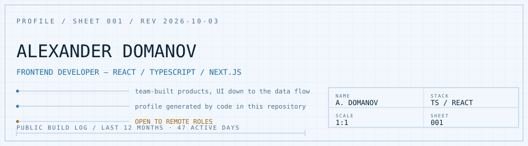
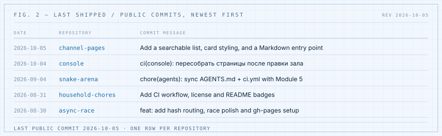
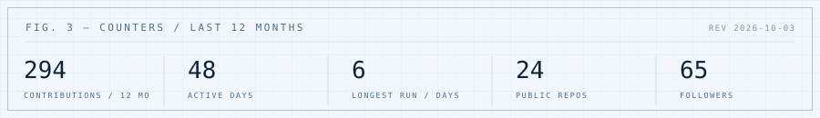
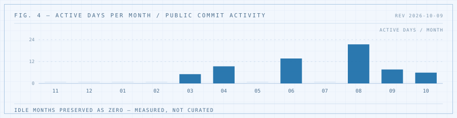
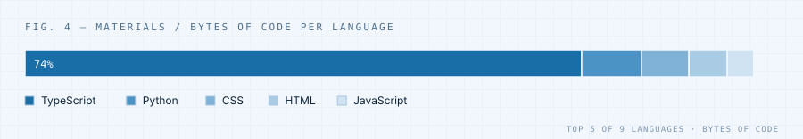

# Frontend, beyond the component

I work with **React, Next.js and TypeScript** on team-built web applications.

I'm interested in understanding how UI, application state, APIs and user flows work together — and in what happens one layer below the interface.

[Portfolio](https://alexander-domanov.github.io/portfolio-dev/) · [LinkedIn](https://www.linkedin.com/in/alexander-domanov/) · [Email](mailto:alexanderdomanov.dev@gmail.com)

<picture>
  <source media="(prefers-color-scheme: dark)" srcset="assets/out/hero-dark.svg">
  
</picture>

## Right now

Five most recent public commits, one per repository. Refreshed by CI every day, so this is as current as the last push.

<picture>
  <source media="(prefers-color-scheme: dark)" srcset="assets/out/fig-shipped-dark.svg">
  
</picture>

<picture>
  <source media="(prefers-color-scheme: dark)" srcset="assets/out/fig-stats-dark.svg">
  
</picture>

## Selected work

### Interview Canvas — whiteboard for system design interviews

A collaborative board for system design interviews: sticky notes and basic shapes on a shared canvas. I built it as a full-stack application and then kept hardening it until it behaved like a real service, not a homework folder.

**Built:** static frontend over an OpenAPI contract · FastAPI backend · SQLite / SQLAlchemy · unit, integration and E2E tests · multi-stage Docker image · CI · dev/prod deployment with staging on merge and manual production promotion · OpenTelemetry instrumentation with a local Prometheus / Loki / Tempo / Grafana stack · an on-call poller that hands firing alerts to a headless coding agent · an agent extension pack (reusable skills, a specialized subagent, a scoped MCP server, guardrails).

**Stack:** Python · FastAPI · SQLAlchemy · OpenAPI · Docker · GitHub Actions · OpenTelemetry · Grafana

[Repository](https://github.com/Alexander-Domanov/snake-arena) · staging deploys on merge, production on manual promotion

### Inctagram

A team-built social platform with profiles, posts, subscriptions, messaging and an admin application.

**Worked on:** Profiles · Localization · Statistics · Admin features

**Stack:** Next.js · TypeScript · TanStack Query · Zustand · GraphQL

[Client repository](https://github.com/SoundShocking/inctagram) · [Admin repository](https://github.com/SoundShocking/inctagram-admin)

### Async Race

A vanilla TypeScript SPA that drives a REST API: create and edit cars, start races, track winners. No framework — just the platform, `requestAnimationFrame` and state you have to manage yourself.

**Stack:** TypeScript · Vite · REST · CSS

[Repository](https://github.com/Alexander-Domanov/async-race) · [Live demo](https://alexander-domanov.github.io/async-race/)

### Place of Memory

A team-built multilingual platform for documenting Belarusian burial sites in Poland.

**Worked on:** Authentication · Account settings · Localization · Memorial places · Responsive UI

**Stack:** Next.js · TypeScript · Google Maps · Internationalization

[Repository](https://github.com/Alexander-Domanov/placeofmemoryclient)

## What I've worked with

| | |
|---|---|
| **Core** | HTML · CSS / SCSS · JavaScript · TypeScript · React · Next.js |
| **Application** | REST APIs · GraphQL · TanStack Query · Redux Toolkit · Zustand · React Hook Form |
| **Backend, on my own projects** | Python · FastAPI · SQLAlchemy · SQLite · OpenAPI · Docker |
| **Tools** | Git · GitHub Actions · Storybook · Figma |

## Activity

<picture>
  <source media="(prefers-color-scheme: dark)" srcset="assets/out/fig-load-dark.svg">
  
</picture>

<picture>
  <source media="(prefers-color-scheme: dark)" srcset="assets/out/fig-stack-dark.svg">
  
</picture>

The quiet months are in the drawing on purpose. I would rather show a real measurement than a tidy one — and the point of putting it here is that it stops being quiet.

## Outside the editor

Endurance sports: long distances, slow pace, a lot of patience. One of my long-term goals is to run an ultramarathon and complete an IRONMAN. Seven years in coffee shops taught me the same lesson from the other side: good results come from a repeatable process, not from bursts of enthusiasm.

## Contact

Open to remote frontend opportunities.

[Email](mailto:alexanderdomanov.dev@gmail.com) · [LinkedIn](https://www.linkedin.com/in/alexander-domanov/) · [Portfolio](https://alexander-domanov.github.io/portfolio-dev/)

---

Every figure on this page is generated from public GitHub data by [`scripts/profile_svg.py`](scripts/profile_svg.py) — stdlib Python, no third-party widget services — and refreshed daily by [`.github/workflows/profile.yml`](.github/workflows/profile.yml). The same numbers are in [`assets/out/manifest.json`](assets/out/manifest.json) if you want to check the arithmetic.
