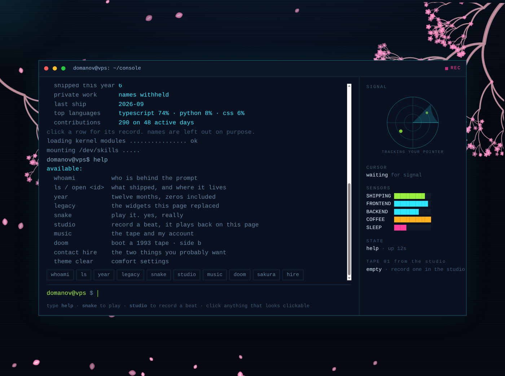
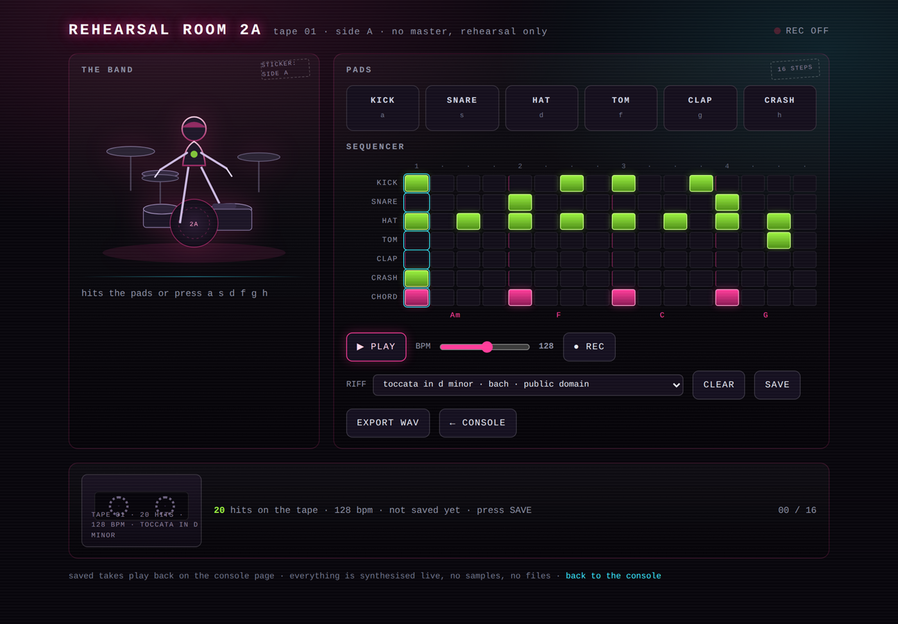
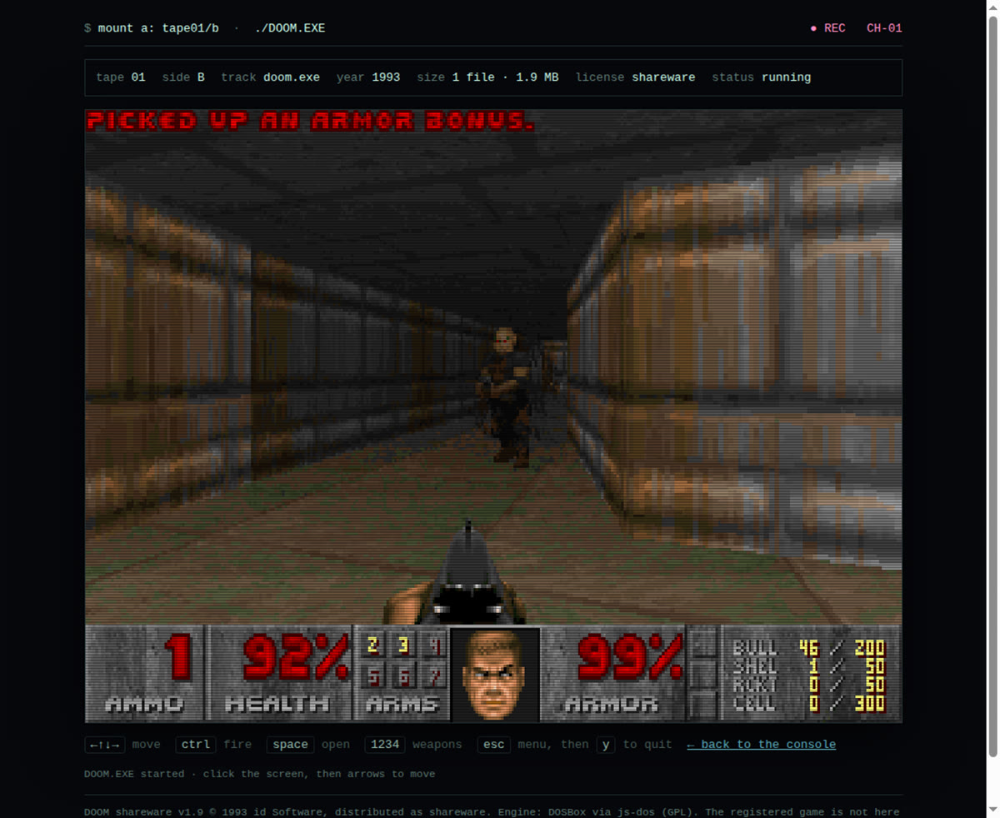
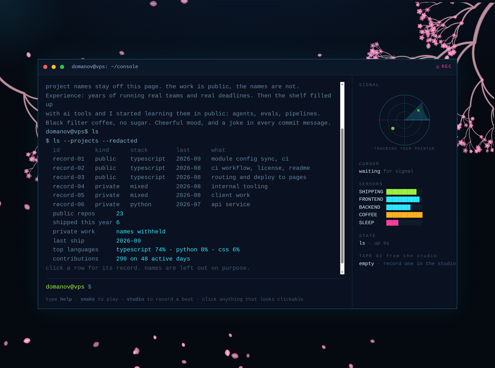

<!-- room:start -->

<!-- room:end -->

  

  <b>the window above is a page, not a picture.</b> click it, type <code>help</code>, and you get a real terminal: <code>whoami</code> · <code>ls</code> · <code>snake</code> · <code>studio</code> · <code>doom</code> · <code>sakura</code>

---

Most profile pages are the same four widgets in a different order: a badge wall, a stats card, a typing line, a trophy shelf. I had all of those here a week ago. Then I deleted them and built one room instead, and put everything in it.

**[alexander-domanov.github.io/console](https://alexander-domanov.github.io/console/)** — static files, no build step, no widget service.

## `$ whoami`

Frontend developer. Years of running real teams against real deadlines, then the shelf filled up with AI tooling and I started learning it in public: agents, evals, pipelines.

Belarus, remote, Russian and English. Open to international teams.

Black filter coffee, no sugar, cheerful mood, a joke in most commit messages.

## Four rooms behind that window

### 1. the console — [type into it](https://alexander-domanov.github.io/console/)

Ten commands, one screen, no reloads. `whoami` answers with the short version of me, `ls` prints the redacted ledger below, `snake` drops a playable grid into the terminal, `legacy` opens the graveyard of the widgets this page replaced. Click anything that looks clickable — rows, chips, the tape. The pointer is tracked, so the radar in the corner and the petals on the branch follow it.

### 2. the studio — [record something](https://alexander-domanov.github.io/console/studio.html)

Four drum pads, an eight-step tape, one record button. Hit REC, play a bar, stop: the loop walks back to the console page and plays there, named and dated. Every sound is synthesised in the browser with Web Audio. No samples, no mp3, no files at all — the whole instrument is about 150 lines of `engine.js`. Bring your own melody: it does not have to be mine.

### 3. tape side B, 1993 — [boot it](https://alexander-domanov.github.io/console/doom.html)

`doom` boots DOOM v1.9 shareware, released in 1993, inside the page. DOSBox compiled to WebAssembly, running the shareware episode straight out of my own repository. Same joke as the rest of the page: old software, new packaging. The registered game is not in there, only the shareware episode, with the credit under the screen.

### 4. the redacted ledger — `ls`

My repositories are public, their names are not on this page, on purpose. `record-01 … record-06`, one line each: kind, stack, last ship, what it does. The private work stays nameless too. Anyone who needs the links can ask.

## What is under the hood

- **static** — three HTML files and one JS file. No framework, no npm, no bundler, no deploy step beyond a push.
- **no third-party widgets** — no badge service, no stats service, no typing animation, no tracking. The radar, the petals, the tape and the ledger are drawn in the page itself.
- **sound without sound files** — oscillators, envelopes and a noise buffer built at runtime.
- **a real emulator, self-hosted** — js-dos/DOSBox (GPL) plus DOOM shareware v1.9 (© 1993 id Software, distributed as shareware).
- **fork it** — the whole console lives in [Alexander-Domanov/console](https://github.com/Alexander-Domanov/console). Clone it, keep one room, delete the rest.

## The numbers, anonymously

| | |
|---|---|
| Contributions, last year | **290** on **48** active days out of 371 |
| Longest run | **6** days |
| Public repositories | **23**, of which **13** are written by me |
| Most of the code | TypeScript, then Python and CSS |
| Private work | names withheld |
| Last ship | 2026-09 |

The quiet months are in the count on purpose. A real measurement beats a tidy one, and the point of writing it down is that it stops being quiet.

## Steal a piece of it

Each room works alone, so take one and leave the rest.

| you want | take | how hard |
|---|---|---|
| a terminal as your profile page | [console](https://github.com/Alexander-Domanov/console) | clone, edit the `whoami` data block, push |
| a drum machine in the browser | [`engine.js`](https://github.com/Alexander-Domanov/console/blob/main/engine.js) | one file, no dependencies, bring your own melody |
| a DOS game as an easter egg | [`doom/`](https://github.com/Alexander-Domanov/console/tree/main/doom) | drop your own `.jsdos` bundle next to the player |
| a radar, falling petals, a cassette tape | the console's page source | plain canvas, no library |

## What I work with

| | |
|---|---|
| **Core** | HTML · CSS / SCSS · JavaScript · TypeScript · React · Next.js |
| **Application** | REST APIs · GraphQL · TanStack Query · Redux Toolkit · Zustand · React Hook Form |
| **Backend, on my own projects** | Python · FastAPI · SQLAlchemy · SQLite · OpenAPI · Docker |
| **Tools** | Git · GitHub Actions · Storybook · Figma |

## Outside the editor

Endurance sports: long distances, slow pace, a lot of patience. One long-term goal is an ultramarathon and an IRONMAN. The habit transfers — results come from a repeatable process, not from bursts of enthusiasm.

## Contact

Open to remote frontend work with international teams.

[Email](mailto:alexanderdomanov.dev@gmail.com) · [LinkedIn](https://www.linkedin.com/in/alexander-domanov/) · [Portfolio](https://alexander-domanov.github.io/portfolio-dev/)

---

Everything on the console is static and open: read it, copy it, take one room. The figures in the repository are drawn by [`scripts/profile_svg.py`](scripts/profile_svg.py), stdlib Python only, and refreshed daily by [`.github/workflows/profile.yml`](.github/workflows/profile.yml). The arithmetic sits in [`assets/out/manifest.json`](assets/out/manifest.json) if you want to check it.
